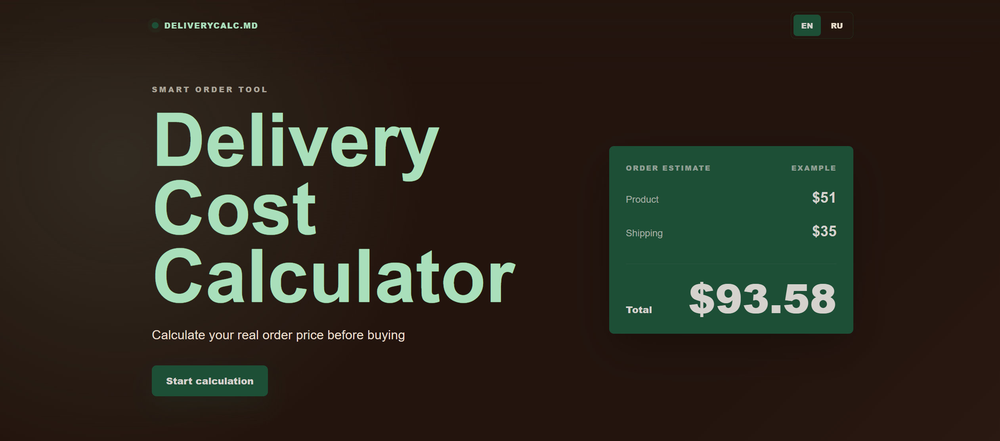
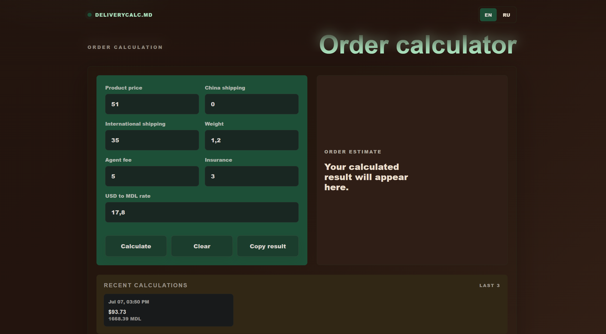

# Delivery Cost Calculator


**Delivery Cost Calculator** - минималистичный сайт-калькулятор доставки и итоговой стоимости заказа из Китая.

Пользователь вводит цену товара, доставку, вес, комиссию агента, страховку и курс USD к MDL, а сайт рассчитывает итоговую стоимость в долларах и молдавских леях.

## Preview





## Live Demo

[Открыть сайт](https://delivery12335.github.io/deliverycalc/)

## Features

- Расчет итоговой стоимости заказа
- Конвертация USD в MDL
- Расчет цены за килограмм
- Добавление процента страховки
- Сохранение последних 3 расчетов в LocalStorage
- Копирование результата в буфер обмена
- Переключатель языка RU / EN
- Адаптивный дизайн для телефона и ПК

## Tech Stack

- **HTML** - структура страницы
- **CSS** - адаптивный интерфейс и визуальный стиль
- **JavaScript** - логика калькулятора
- **LocalStorage** - история последних расчетов
- **GitHub Pages** - публикация сайта

## Project Structure

```text
delivery-cost-calculator/
├── index.html
├── style.css
├── script.js
└── README.md
```

## How to Run

1. Скачайте или клонируйте репозиторий.
2. Откройте файл `index.html` в браузере.

Backend, база данных, сборщики, npm и фреймворки не нужны.

## Formula

```text
subtotal = productPrice + chinaShipping + internationalShipping + agentFee
insuranceValue = subtotal * insurance / 100
totalUsd = subtotal + insuranceValue
totalMdl = totalUsd * usdToMdlRate
pricePerKg = totalUsd / weight
```

## Author

Made by **Max**

GitHub: [delivery12335](https://github.com/delivery12335)
